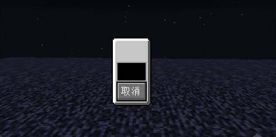

# Minecraft Flex UI

# 介绍
基于 `facebook` 开源的 `Yoga` 布局引擎实现了基于 `Flex` 布局的 `Minecraft` GUI框架。

在 `Yoga` 的基础上实现了 `Flex` 标准的子集的同时也一并实现了多数的 `CSS` 属性。

采用 `MVC` 的设计理念，实现了数据的单向与双向绑定。

开发者可在此之上设计与实现复杂的UI界面，并且本项目可作为 `Yoga` 引擎嵌入到游戏中作为游戏布局引擎的不完全参考实现。

# 示例



```java
public class WidgetTestScreen extends WidgetScreen {
	protected StringBuilderObservable text = new StringBuilderObservable();

	public WidgetTestScreen() {
		super(Text.of("test"));
	}

	@Override
	public void widget(ScreenWidget root) {
		root.flexDirection.set(WidgetFlexDirection.Row)
				.justifyContent.set(WidgetJustify.Center)
				.alignItems.set(WidgetAlign.Center)
				.child(new BoxWidget()
						.background.set(RectDrawable.LIGHT_PANEL)
						.child(new LabelWidget()
								.text.binding(text.computed((StringBuilderObservable text) -> Text.of(text.getString())))
								.margin(WidgetEdge.All, 4))
						.child(new TextBoxWidget()
								.text.binding(text))
						.child(new ButtonWidget()
								.click.on((mouse) -> close())
								.child(new LabelWidget()
										.text.set(Text.of("取消"))))
				);
	}
}

```

# 数据绑定
默认所有来自`非计算绑定源`的所有绑定都是`双向绑定`。
> 对`计算绑定源`设置值会被忽略

**但大部分组件对于绑定值都只会是`单向操作`**

# 组件介绍

## BoxWidget
最基础的布局小组件，对标`HTML`中的`div`

## LabelWidget
文字标签小组件，最基础的文字显示组件。

对标`HTML`中的`p`

## TextBoxWidget
文字输入框小组件，文字输入组件

## ButtonWidget
按钮组件